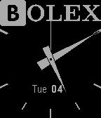

# 🅱️olex watchface



Example analog watchface that uses hands instead of numbers, and says 🅱️olex at the top. This was made for a joke.

Based on the [simple-analog](https://github.com/pebble-examples/simple-analog) example from the Pebble watchface examples repository.

These Pebble watches were so good for their time, and dusting mine off for a dumb joke was a fun experience. In my opinion, these are the perfect smart-enough watches.

RIP Pebble.

## Building

Run the [Rebble Pebble SDK Docker container](https://github.com/pebble-dev/rebble-docker):

```shell
docker run --name=PebbleSDK --rm -it \
  -e DISPLAY=$DISPLAY \
  -v /tmp/.X11-unix:/tmp/.X11-unix \
  -v ~/.Xauthority:/home/pebble/.Xauthority \
  -v $PWD:/home/pebble/dev \
  rebble/pebble-sdk
```

This will drop you to a root shell in the SDK container.

Change directory to your code's volume mount:

```shell
cd /home/pebble/dev
```

Build:

```shell
pebble build
```

Install to the emulated Pebble to make sure it works:

```shell
pebble install --emulator aplite
```

Finally, install to your real Pebble using the [Pebble developer connection](https://developer.rebble.io/developer.pebble.com/guides/tools-and-resources/developer-connection/index.html):

```shell
pebble install --phone 10.13.37.69
```
